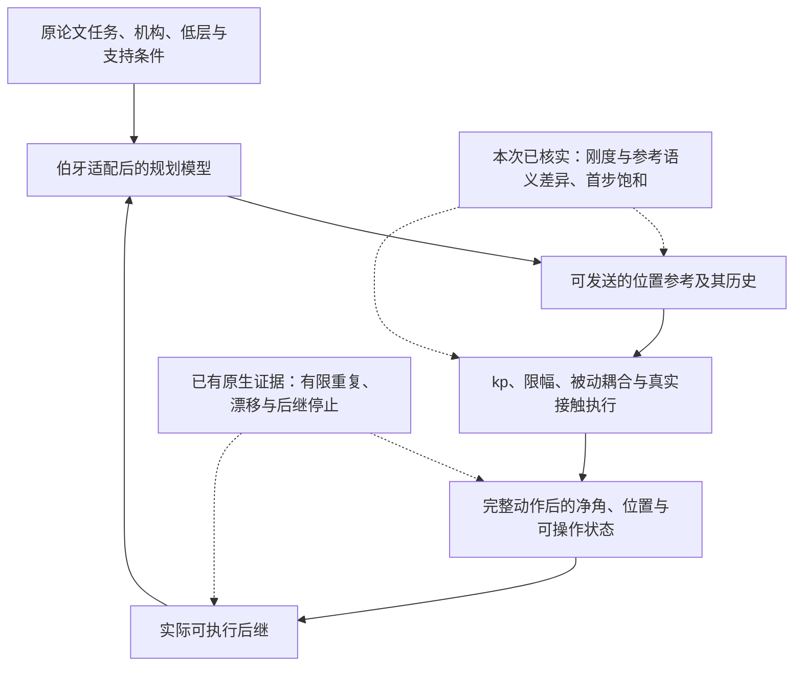

# 非学习旋转复审：执行模型与接触后继仍有缺项

2026-10-08。**仍有值得验证的非学习路线，现有证据不足以认定伯牙手
机械上做不到。当前最值得处理的是规划—执行不一致，以及整段动作
结束后能否继续操作；继续扩大冻结版本的局部搜索没有充分依据。**
这不是已经找到持续旋转解法，也不是原论文方法的公平性能排名。
本次新增的是代码、历史和文献审查及归档算术，**0新仿真积分、0控制
搜索、0新控制episode**。建议的架构尚未实现或执行。

审查基准固定为`b121e098ed661604c2c7c6c0066736ae0ae4f687`，包含联合
长程结果及其冻结决定。[机器覆盖记录](data/coverage.json)逐文件读取
1,909份受版本管理的文本/源码/小证据，共32.67MB；其中529份Python、
77,934行，331份Markdown、695份JSON、338份CSV，AST/JSON/CSV解析
无错误。输入改为直接读取该提交的Git对象，避免随后新增的学习基线、
视频工作或未提交修改混入旧结果。学习分支不参与本次非学习结论。

历史覆盖93个实验分支：接续[已有92分支总账](../2026-10-07-history-model-audit/BRANCHES.md)，
补入旋转demo，核读最新联合长程、周期反馈、PBDS原抓取后续和小表。
代码重点核查场景/执行器、原生规划与验收、换指/后继，以及FREE、
DROP、Jiang两入口的模型/动作接口；旧模块逐项定位见
[源码清单](data/repository_inventory.csv)和[历史证据](../2026-10-07-history-model-audit/EVIDENCE.md)。
机器读取全部文件不等于逐行理解全部代码；原约11.62GB outputs按索引
和决定性记录选择核对，没有逐条审完或重放所有大日志。

本文的比较场景是原40×32mm圆柱/50g/抓取44/原朝向/世界−z/μ=.5，
13主动位置输入、原kp10、腕和LF固定；补丁MuJoCo3.13 native CCD+
multiccd、0.5ms物理步。允许指侧、指节、掌面真实接触，保留5mm位置、
15°轴倾、12N组力、1.5mm对象/自穿透、实际承托、无地面/外撑和数值
有效性检查；近期真实承托按至少两指正载计，掌面仍允许参与接触。
旧ROI、旧力带、释放余量和完成规则单独保留；不追认旧停止后的执行。
全真值离线开发允许，部署观测和硬件鲁棒性另验。120s demo以物理
有效前缀的**有符号净旋转**计分，保留峰值、倒转和实际停止原因，
没有新增圈数目标或倒转拒绝条件。

当前实际证据如下，全部来自已有episode，本次只复核/归档重算。
[冻结比较快照](data/archived_demo_scores.csv)保留来源、引擎和原停止；
[原demo物理记录](../../experiments/2026-10-07-rotation-demo-benchmark/data/scores.csv)
保留首个违规类型。不同有效长度、原规划预算及输入权限不能省略。

|实现／匹配执行来源|有效物理时长s|末净角°|峰角°|实际停止与解释|
|---|---:|---:|---:|---|
|[native输运路径v6](../../experiments/2026-10-07-native-relocation-path/README.md)|55.630|75.003724|75.006147|未找到完整正净转后继；24次实际换指，已执行段物理过，不是掉落|
|[C2周期末态反馈](../2026-10-07-failure-driven-validation/FOLLOWUP_RESULTS.md)|120.000|33.099773|47.125430|物理时间窗结束；7次完整MF释放/接回，漂移仍接近5mm|
|[冻结局部PBDS](../../experiments/2026-10-05-pbds-original-grasp/README.md)|19.0395|17.399645|17.399645|原ROI法向分类停止；归档重评不等于放行后的新接续|
|[采样MPC demo](../../experiments/2026-10-07-rotation-demo-benchmark/README.md)|120.000|15.714510|19.526096|time_limit；往返角度很大，净推进有限|
|[固定联合节点循环](../2026-10-08-joint-long-run/README.md)|101.384|14.858990|29.022569|第101.3845s首次位置漂移超5mm，仍TH/FF/RF真承托|
|[原两周期联合版](../2026-10-07-joint-native-trajectory/README.md)|30.060|7.862887|21.082614|预设两周期验证结束，收尾记录异常已恢复；不是测得的能力上限|
|当前FREE适配|.0005|.086454|.086454|随后lost_support|
|当前DROP适配|0|0|0|首步excess_force，无有效物理前缀|
|当前Jiang单轴适配|.008|−.421756|0|随后lost_support|
|当前Jiang高低层适配|.187|−.573071|0|随后lost_support；不能与单轴入口混为一版|

原观测/时间差异仍重要：上述原生方法的全真值规划大多暂停物理；
C2每周期还进行端点响应重算。联合循环执行只读冻结节点/时间/历史
参考，真值用于监测；其原两轮求解成本至少712.16s，原600s墙钟硬
预算因批次检查粒度未守住。外部基线各用原求解器及各自模型步长，
具体时序见[demo协议](../../experiments/2026-10-07-rotation-demo-benchmark/PROTOCOL.md)
和[基线接口](../../baselines.md)。同120s上限不构成相同在线计算预算。

旧未补丁wheel **333s/722.337627°**真实有限成功仍保留；匹配未补丁
编译版319.5s/721.168°另列。补丁匹配版54s/12.775°停滞，450s诊断
也仅30.839°。这不是同一引擎的性能波动，不能将旧角度补进新控制器
成绩；也不能因补丁版失败撤销旧记录。碰撞法向修复有夹具和同状态
证据，但它对整条旧成功的收益尚未量化，不能认定这是全部原因。
具体来源见[历史引擎核对](../2026-10-07-history-model-audit/EVIDENCE.md)。

本次新增的强证据来自**位置指令实际产生了什么电机力矩**。
[归档核算](data/archive_analysis.json)与[逐电机表](data/first_command_motor.csv)
直接取原稳定初态、原XML和四条已执行基线的首条指令。该场景使用
无速度偏置的仿射位置电机，因此初态下实际执行律为：

`τ = clip(kp × (clip(ctrl, ctrlrange) − q_actual), forcerange)`。

这里的原初态13个主动电机全部存在非零预载，最大绝对值
**.077083Nm**。将目标改为当前测得关节角、给零增量，在代数上将这些
电机的控制力矩变成0；它不是原已加载的保持指令。这是未执行的
反事实计算，既不等于全部接触力马上消失，也不是实际掉落证据。

|入口|首条指令饱和主动电机／13|最大未限幅请求Nm|与归档实际电机最大误差Nm|具体模型/接口问题|
|---|---:|---:|---:|---|
|FREE|12|2.000000|2.78e−17|[Params](../../../rotation/backends/free.py)令`robot_stiff_=I`，执行却是`kp=10`；原论文Table VI要求`Kr=Kp I`。计划还没有忠实包含实际±.3Nm力矩限幅|
|DROP|11|4.401574|1.39e−16|首命令已严重限幅；预测MuJoCo3.1.4/10ms与执行补丁3.13/.5ms不同，不能假定计划响应等价|
|Jiang单轴|0|.012500|4.44e−16|[plan](../../../rotation/backends/jiang.py)发送`q_actual+action`，首条13维动作均仅±.00125rad；更换了原预载参考，且1DoF物体模型无法预测自由物体重力支持|
|Jiang高低层|0|.070446|8.88e−16|已连接两层并保留初始目标，不存在上述单轴入口的同一参考替换；仍有被动耦合近似与低层抓取矩阵只选[0,4,5]行的范围限制|

FREE也发送测量角加动作，但**`q_actual+delta`本身不是错误公式**：
原求解器的增量正是按这种定义建模。需要同时对齐原保持偏置、模型
刚度、饱和和输入语义，不能在求解后盲加`ctrl`偏置或只改一个增益。
当前首条FREE求解状态是`Solve_Succeeded`，仍不代表物理执行可行。
DROP的饱和也不证明规划器没有建模限幅；模型/引擎同一性须另核验。
这些量化检查确认移植契约未充分对齐，**没有完成单因素因果执行**，
不将其宣称为失撑的唯一原因或“改完必能转”。

原生方法的失败另有一组已经证实的限制，不能全部归为外部模型失配。
多个原生分支的预测、实际和独立同模型重放逐值吻合，却仍无长程后继。
这种一致性支持该模拟模型内的执行归属，不证明真实物理正确或现实
鲁棒。新增真值或换一个模型名称不能自动补回所消耗的可操作性。

|历史中已确认的限制|依据|结论的边界|
|---|---|---|
|固定输入重复后状态不重复|联合循环末漂移依次.0166、.1291、.9227、1.4475、3.3477、3.9666mm；第七部分触界|六次真实MF换指已完成，但没有建立持续位置保持；无在线全阶段重优化|
|现有联合目标不是最大净转|[目标审计](../2026-10-07-joint-native-trajectory/OBJECTIVE_AUDIT.md)：选中7.862887°/.129145mm，未选物理过预测8.229827°/.270407mm；按加权残差排名|不保证改权重即持续；冻结版不重开扫描|
|所谓全阶段变量仍受固定模板限制|156参数=2轮×6节点×13通道；固定MF顺序/阶段时间、±.01rad局部偏置、三次重新线性化|与长程拓扑/模式/时长和当前状态一起求解仍有区别；联合优化概念早已尝试|
|回程和往返抵消大量推进|归档累计反/正角：v6 24.13%、C2 80.83%、采样MPC 97.64%、联合循环89.74%|仅解释净角损失，不新增倒转停机条件；不把总正角当成绩|
|一些停止来自额外规则|PBDS原抓取RF仍1.40166N，只因法向.499978低于.5归nonpad；另一例是FF回摆/期限。整轮v5/v6也有额外姿态/home终端拒绝|不是对应物理支持崩溃；但未提交预测不能追认为实际持续成功|

抓取/尺寸/姿态改变、单指释放接回、保留TH承托、小指与16关节、
65维完整周期CEM、接触图/动力学边、独立后继、整轮筛选、C2反馈、
156维有限联合节点及固定输入重复都已经试过。将它们换名为“周期”、
“闭环”或“全局”不能成为新路线。具体版本与停止原因保留在历史总账；
局部PBDS、局部生成/整轮筛选、固定联合循环的冻结边界均维持。

文献方面，核读13篇相关全文，7篇本轮取得、6篇历史原文重新核验；
三库9条定向查询、103条记录、89个规范化题名。逐论文条件、准确版本、
全文读取位置和检索局限见[文献矩阵](LITERATURE.md)。几类差别解释了
为什么“用了同一种算法”并不代表做了同一个问题：

|决定性差别|原论文证据|对伯牙迁移的含义|
|---|---|---|
|外部支撑/自由度|DROP会放回掌面；Jiang前作RotZ固定阻尼铰链，Free由桌面支撑；FREE的Allegro例程掌朝上|这些计划不能直接验证5mm内的自由物体重力承托；FREE也有独立指尖悬空仿真，不能把它全说成桌面工作|
|机构、形状和低层|Faive：11DoF绳驱/65mm硅胶接触球/低层腱长估计；Model Q：对指差动与掌内110°转轴；Fan：12独立关节/直接力矩|非学习可以工作，但我们的位置内环、腱耦合、40mm圆柱和限幅须进入模型；不能只移植高层代价|
|真正接近目标的非学习证据|[原SafePBDS §VIII-D](https://arxiv.org/html/2605.21811v1)：掌朝下真机、约60mm瓶、双方向均超过360°，含加重和摆臂条件；[Fan](https://arxiv.org/html/1710.10350v1)：持续旋转仿真|不能说非学习全靠外撑。SafePBDS用完整树/下一可抬指force closure和原约束链，本地冻结核不等于完整移植；Fan仍无该文真机证明|
|长程求解和低层有效域|CMGMP/全局CQDC/TrajectoTree有模式树和轨迹协调；也明确有黏着、准动态和机构专属回位限制|可借求解结构，仍须实际执行器与动态验证；不是接入原库便自动成立|
|接近任务的最新MPC含学习先验|[Primitive-informed MPC](https://arxiv.org/html/2609.14868v2)：Allegro/40mm六角物/悬空真机；SAC轨迹提取先验，无先验100→600样本仍约120–150°停止|为协调动作先验和在线修正提供证据；原方法不能列为严格非学习解法，手工先验是否等效尚未验证|

论文多为不同任务、物体和停止定义，且成功报道不能提供伯牙的成功率。
SafePBDS有限超过360°与实际扰动实验也不是无限旋转证明。没有一篇
在本手相同抓取、执行器、引擎、观测、时间和物理界下证明了直接可用。

我建议按下面的优先级保留非学习路线。它们是可审查的工程工作项，
不是新的已执行实验或求解器成功承诺。

|优先级／工作|必须补入的具体能力|怎样与已试工作区分／怎样判定|
|---|---|---|
|1. 校正并核验规划—执行契约|保持初态带载参考；实际kp/力矩与位置限幅；被动耦合；同引擎；自由6DoF重力/接触；相同更新/保持/插值时间|新因素是修正已量化的模型/输入不一致，不是参数扫描。先用固定归档状态与指令验证响应/支持/力矩，再将修改作为新版本从原初态执行；不得只给优化结果加偏置|
|2. 模式序列与整段真实输入共同规划|把卸载/推进/自由回位/接近/重载所有阶段、阶段时长及后继资源一起求解；根据当前实际状态更新。原生模型验证全段，最大化有符号净进展，物理界保留|借TrajectoTree/CMGMP的序列搜索、Fan可操作性、SafePBDS下一指准备。已有图/宏/65维周期不能再改名；新增必须能改变固定模式/时间/小偏置限制，并为完整输入和后继状态负责|
|3. 有条件做完整原SafePBDS迁移|保留原树、下一待释放指的force closure、完整约束及真实位置内环；把16独立关节假设转成13绳驱实际可达约束|与冻结的局部核分开。官方演示中零重力、对象施力/速度清零的差异须继续排除；只按真实手接触和声明控制输入计新episode，不能以调阈值代替完整迁移|

第二项不预设必须全动力学单层优化：可比较准动态模式搜索加执行器
感知低层/原生全段验证，与原生动力学分段打靶。现有记录不能选出
必胜求解器。判断标准是能否产生之前的固定模板/局部生成器没有找到
的实际输入与正净转后继，并在后续当前状态继续有效；不是理论模型
更复杂、IK到位或末态静止。终端表达任务所需的承托和继续操作能力，
不先强制所有关节回原home，不把一个末态盒叫已经证明的不变集。

复用归档协调动作作非学习种子也可以考虑，但必须标明来源及状态
适用域。原P13用训练得到的先验；用手工/归档种子替代仅是假设，既有
固定循环和结构化bank已经说明重复种子本身不够。硬件位置/力先到
停止、0力/0速度的真实语义及采样/延迟标定仍是独立后续工作，见
[已确认硬件接口](../../hardware_interface_confirmed.md)，不能拿未完成
硬件标定解释当前同模型特权仿真里已经出现的后继失败。

后续若实现新控制器，需事前固定源码、配置、输入定义和计算预算，
从原初态独立连续运行，保留120s内有效净角/峰角/正反运动/真实换指/
实际停止。当前最高75.003724°是参考记录，不是新的通过门槛；未找
到后继只能说明该方法和预算未找到，找到有限后继也不等于持续性。
混合继续、诊断起态和离线预测均另列，不拼角度、不追认成功。

复核入口为[预先分析边界](ANALYSIS_PROTOCOL.md)、
[机器审计脚本](audit_repository.py)、[归档核算脚本](analyze_archives.py)、
[主张来源](data/claim_sources.json)与[交付校验](data/verification.json)。
原文检索使用paper-lookup/literature-review；其工具论文引用和完整
13篇文献身份保留在[LITERATURE.md](LITERATURE.md)，不作为控制能力证据。
