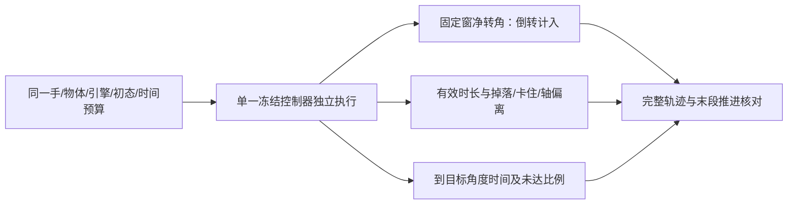

# 持续旋转指标与 Sharpa 证据核验

2026-10-08。结论：保留伯牙已声明的共同 **120s 窗内有效执行前缀的有符号净转角**
作为主排名指标，另报 30s 窗以方便理解论文习惯；配套有效时长、末 30s 推进、峰角、
倒转、物理失效原因。到 360° 的时间及到达比例是辅助指标，不增设圈数成功门槛。
不同机器人、物体、轴、输入或时间窗的论文数字不构成同一排行榜。

本次是有界、指标导向的文献核验，不是穷尽全网的系统综述。核对八篇全文，其中
六篇直接涉及旋转，Dactyl用于区分目标重定向任务，DexTaG排除直接旋转排名。
原文/源码地址、页码、原始查询、下载及文本哈希见 [小证据](data/paper_manifest.json)、
[检索记录](data/search_provenance.json) 和 [Sharpa官方源码核对](data/sharpa_source_audit.json)。

## 原论文到底测什么

|来源|任务与主指标|已核实的原始结果|解释边界|
|---|---|---|---|
|[Hora](https://arxiv.org/abs/2210.04887v1)，CoRL2022|Allegro单轴；真机30s转角（**弧度**）、归一化TTF；仿真另用20s|图3/p6：6种重物×20初始抓取，23.96±3.16rad≈3.81±.50圈；TTF .98±.08，平均29.4s|不是23.96圈。附录p11：33物体中22个几乎稳定续转，困难物体可能10–20s掉落；不证明无限运行|
|[AnyRotate](https://arxiv.org/abs/2405.07391v3)，CoRL2024|Allegro多轴/不同手朝向；600控制步=30s，Rot圈数与TTT|表2/p7：掌朝上z 1.57±.57圈，TTT30±0s；掌朝下z 1.33±.44圈，TTT28.2±3.1s|p6：掉落、卡住或轴偏离均可终止；目标连续达成数也用于训练分析，不等于完整圈数|
|[TouchDexterity](https://arxiv.org/abs/2303.10880v4)，RSS2023|Allegro触觉；仿真CRR是累计旋转奖励，真机CRA是圈数，并报TTF|表I/p7：3训练seed、30s；见过的圆柱C1 4.91±.52圈/TTF30±0s；未见soupcan 4.25±1.56圈/TTF27.33±4.62s|单物体数据和跨物体平均不可直接混比；奖励、真实角度和传感诊断的40/60s片段分别标注|
|[RotateIt](https://arxiv.org/abs/2309.09979v2)，2023|视觉+触觉、多轴；RotR投影角速、RotP正交旋转、20s归一化TTF；真机弧度|指标p6；真机p9多物体x轴约2πrad/20s|与Hora的z轴任务/观测不同；正交旋转提供轴保持的辅助指标|
|[Dactyl](https://arxiv.org/abs/1808.00177v5)，IJRR2019|Shadow手随机目标重定向；连续达成目标数|6.2/表3/p10：真机block-state平均18.8、median13；锁腕平均26.4、median28.5|掉落、单目标80s超时或50目标结束；50次目标成功不是连续旋转50圈|
|[Tacmap](https://arxiv.org/abs/2602.21625v2)，2026预印本|SharpaWave密集触觉仿真/现实一致性；球旋转用于迁移展示|p7为PPO球旋转定性展示，定量表主要是触觉几何/精度|没有核实到圈数/旋转寿命统计，不能由视频补造数字|
|[TacBPM](https://arxiv.org/abs/2609.18174v1)，2026预印本|SharpaWave，20Hz本体+触觉，动作环无物体姿态反馈；20s有符号角度和目标成功率|IV-D/p6、表IV/p7：corner block +z平均806°、10/10；small tennis +z平均945°、10/10|成功是20s内沿指定方向>180°，之前掉落/卡住失败；该成功率本身不证明整个20s持续推进。这是另一篇方法，不能归给RL Lab代码|
|[DexTaG](https://arxiv.org/abs/2609.33882v1)，2026预印本|书写/锤击等工具任务，轨迹完成率和阶段成功率|全文任务定义已核对|排除直接圆柱旋转排名，仅作触觉学习上下文|

TouchDexterity DOI：[10.15607/RSS.2023.XIX.036](https://doi.org/10.15607/RSS.2023.XIX.036)；
Dactyl DOI：[10.1177/0278364919887447](https://doi.org/10.1177/0278364919887447)。
两项由Crossref题名记录和全文交叉核对。2026预印本单列，不冒充已同行评审的经典论文。

## Sharpa RL Lab 与相关论文分开

官方 [sharpa-robotics/sharpa-rl-lab](https://github.com/sharpa-robotics/sharpa-rl-lab/tree/95ccda3d948801bb5da4cb7ffea766e03067a63b)
固定在commit `95ccda3d948801bb5da4cb7ffea766e03067a63b`。README推荐48×60mm圆柱，
提供抓取缓存→PPO→本体历史适应→部署。配置22动作、192观测、30帧历史、16384环境、
**20s episode**；PPO.test循环无限调用step，环境会按episode时限/高度失败reset，
所以一直播放不是一个不停重置的物理任务已持续完成。

官方real.gif共有225帧，每循环显示14.99s，设置无限循环。这只证明动画播放长度；
没有据此数圈、推断真实连续时长或推断同一控制器无reset。尚未核实到该仓库的
长期旋转量化表。Tacmap/TacBPM有关Sharpa团队，但目前没有验证它们的算法/权重
与RL Lab仓库相同；TacBPM的806°/945°不能当成复制的RL Lab基线成绩。

原用户fork `5accf024...` 与官方README、LICENSE、NOTICE、PPO YAML、play一致；
三个任务/配置/抓取文件的Python AST **不同**。模型、normalizer和PPO AST一致。
原fork和旧网络等价测试保持原身份；官方选定源码另存 `third_party/sharpa_upstream`，
仅补引用注释、保留许可和哈希，尚非完整可运行官方仓库或已训练伯牙控制器。

## 伯牙采用的共同报告

1. 主指标θ：从初态开始积分的有符号、解缠转角，到共同时间窗结束或首个物理失败。
   首个失败帧保留为证据但不计分。所有reset/控制器切换都单列，不拼接。
2. 伯牙历史角度是沿**运动中的圆柱轴**积分、direction=-1，倾斜相对初轴；不是SO(3)
   两姿态距离、模360角或固定世界z投影。保留这个定义以保持历史比较。新增引擎应
   同时记录角速度/姿态以补报指定固定轴投影及正交运动，并明确分别的定义。
3. 同时报告T_valid、物理失败/停滞/时限等实际原因、最大位置与轴偏移、真实接触/力、
   穿透/外部支撑、峰角和倒转。满窗保持不等于持续旋转；末30s推进用于辨别初始突转。
4. θ/共同预算与θ/有效时长分别命名，失败后不虚构继续执行。早期掉落的高速不能单靠
   有效时长平均速度冒充稳定能力。未跑满120s不能从30s数据外推。
5. 到90/360/720°的首次采样时间只作诊断，不作为新的圈数门槛。报告未达比例，失败/未达
   不从均值里删除；正式多次实验需报告全部样本/成功率及删失范围。
6. 掉落和物理界沿用既有定义；停滞的速度/窗口阈值尚未依据实机观测分辨率校准，暂报
   实际末段角度与速度，不临时发明二元停滞判据或改写旧weak-sign通过结果。
7. 原手原论文与伯牙适配分表；教师特权、本体学生、触觉学生分层。训练样本/seed/推理及
   通信时延、初始抓取分布、随机化/测试条件、公共计算预算均须声明。正式比较至少5训练
   seed及事前锁定的测试条件；先完成机制复现，再用匹配比较判断是否超越。

无指定圈数目标。120s与末30s只是既有有限评测协议，不能据其通过声称无限旋转或真机鲁棒。

## 已有伯牙轨迹重新计分

[JSON](data/archived_metrics.json) / [CSV](data/archived_metrics.csv)。仅离线读已完成档案，
**0新物理步**；原执行/协议哈希通过。保留40×32mm/50g、同一原初态、13路kp10、
固定腕/LF、腱耦合、补丁MuJoCo3.13/.5ms、20Hz/95特权特征和原物理界。

|checkpoint|30s窗净角° / 有效s|120s窗净角° / 有效s|满120s末30s净角°|原episode停止|
|---|---|---|---|---|
|u0历史初始化|94.622083 / 2.506|94.622083 / 2.506|—|漂移失败|
|u32|15.097106 / 30|14.833574 / 120|+.146616|时间窗|
|u64|13.018795 / 30|1.466386 / 110.804|—|漂移失败|
|u128|16.440624 / 30|18.397394 / 120|−.200283|时间窗|

u0首次达到90°为2.362s；所有checkpoint未达360°。u64在30s窗口内没有物理失败，
其110.804s后的失败只写在source_episode_physical_failure；physical_failure_within_window
按各自窗口判断。120s不满窗时不把有效前缀的末30s冒充共同120s的最后30s。
旧headline端点全部一致；这不是新算法进展或新基线执行。

## 检索范围与可复查缺口

OpenAlex `/works`：`in-hand object rotation` 首25条、SharpaWave 9条；额外四个题名/
触觉定向查询分别取最多8条（实际8/8/8/2）。Crossref `/works`：continuous in-hand
object rotation取20条、SharpaWave返回0；三次题名查询各5条用于DOI核对。
广泛检索相关性很差，reported_total不是本综述筛选数，不据此编造PRISMA数量。
查询字符串、参数、UTC日期、返回数、原始响应哈希全部在search_provenance.json。

arXiv API两个广泛查询HTTP429，一次有界重试超时；六份新增PDF通过直接全文地址
取得并检查PDF魔数、页数、抽取文本与SHA，另两份沿用已验证Hora/AnyRotate全文。
本次没有宣称三数据库均成功完成检索、独立双筛或覆盖全部最新文献。
`parallel-cli`及scientific-schematics不可用，没有安装新工具；使用原生Mermaid说明
任务与指标关系。调研流程引用Scientific Agent Skills（见references/README.md），
不是算法基线。

## 后续完整复现的边界

优先Hora：完整任务/抓取缓存/随机化→联合训练教师及物体属性编码→冻结教师的30帧
本体历史适应→不读物体真值的单一冻结学生独立评测。触觉比较参考AnyRotate/Sharpa，
不把更换机器人后的移植称为原手逐项完全相同的实验。详见
[Hora伯牙移植检查单](../../hora_boya_port.md)。Isaac启动及模型转移独立于论文成绩。
