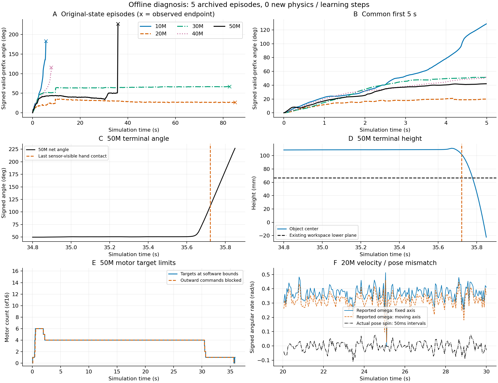

# Boya Hora teacher：5000万步后的离线诊断

2026-10-10。结论：**保持时间明显增加，实际旋转退步；目前不能把主因确定为灾难性遗忘。更直接的问题是旋转奖励与真实姿态转动脱钩，以及动作目标饱和。应先定位接触状态下的速度/姿态输出差异，再决定是否改变奖励，暂不追加长训练。**

后续[读取链路追查](SOURCE_CHAIN.md)：没有发现顺序/坐标/刷新错误，独立SciPy计算复核转角；
差异在接触段显著、脱手段基本消失。已缩小到接触态速度/姿态输出链路，具体引擎机制未证实。
这修正了下面初次诊断直接优先考虑姿态增量奖励的建议，不改变原始数据或主成绩。

本次只分析五个已有评估回合、各自检查点和训练摘要，新增仿真步/训练动作均为0。
没有改奖励、任务规则、控制器、引擎、抓取、观测或历史成绩。
5000万续训已完成，累计50,003,968动作/6104次更新；没有继续启动训练。

## 原始成绩与同一时间段比较

每个检查点只有一次独立、冻结、原始grasp44评估；使用自己的归一化状态，
0重置、0策略切换、0训练动作。20M和30M是1500秒墙钟预算截断，未完成120秒窗口，
也没有观察到物体越界。以下仍是原来的有效前缀成绩，不删除脱手阶段、不另算新主分数。

| 累计动作 | 有效秒 | 净角° | 峰值° | 倒转° | 前5秒净角° | 实际停止原因 |
|---:|---:|---:|---:|---:|---:|---|
| 10,002,432 | 5.5995 | 182.936 | 182.936 | 1.266 | 129.051 | 低于操作区 |
| 20,004,864 | 85.0000 | 26.489 | 35.823 | 85.411 | 19.851 | 墙钟预算 |
| 30,007,296 | 82.7000 | 67.010 | 67.031 | 45.670 | 51.363 | 墙钟预算 |
| 40,001,536 | 7.8495 | 115.525 | 115.525 | 2.004 | 52.332 | 低于操作区 |
| 50,003,968 | 35.8495 | 226.889 | 226.889 | 43.490 | 42.097 | 低于操作区 |

50M前5秒只有10M的约三分之一转角；5–20秒净角−2.455°，20–30秒−4.583°。
前30秒净角35.059°，没有持续正向推进。10M前5秒确实存在明显转动，但随后倾斜、下降并失败，
不能当作已经掌握长期旋转的合格专家。



图A/B比较原始完整轨迹和共同前5秒；C/D对齐50M终止前角度与高度；
E是软件目标限位；F对比20M引擎角速度与四元数实际姿态转动。
物理曲线每20点取1点（100Hz），保留末点；控制曲线20Hz；
F的实际转速为每个完整50ms控制区间的四元数有符号转角除以0.05秒，无其他平滑。
交叉标记表示观测终点，包含墙钟截断；不同检查点不是重复样本，不画置信区间。

## 1. 50M的226.89°不能说明旋转学得更好

最后0.2秒贡献172.271°，占总净角约76%；该段77.5%的物理步没有传感器可见的手部接触。
最后一次可见手部接触在35.722秒，此后至有效终点增加114.649°，约占总净角50.5%。
物体末态中心高度为−21.50mm，低于原有66.80mm操作区下界；末段角速度范数约19rad/s。
这些现象与脱手后快速转动、下降一致，不能作为受控手内旋转的改善。

“无可见接触”使用既有力传感器及1e−6N分组阈值，不等于已验证的力闭合或掉落判别器。
操作区规则仍按连续两个20Hz越界采样终止；本次没有提前停轨迹、过滤末帧或改动主成绩。

## 2. 旋转奖励与真实转角存在实测脱钩

当前移植奖励在控制末端读取引擎报告角速度，投影到**固定原始轴**后裁剪至[−0.5,0.5]。
主转角指标则逐物理步积分实际四元数，投影到**随物体移动的圆柱轴**。

在20M的20–30秒，实际只净转−2.462°，即−0.00430rad/s；
当前公式重建的旋转奖励却平均为**+0.36769/控制步**。
即使改看引擎角速度在移动轴上的投影，控制末端均值仍为+0.32141rad/s。
因此该例的差异不能只归因于固定轴/移动轴选择。

| 20M，20–30秒 | 控制末端均值 | 全部20,000物理步均值 |
|---|---:|---:|
| 引擎角速度，固定轴 rad/s | +0.36775 | +0.36889 |
| 引擎角速度，移动轴 rad/s | +0.32141 | +0.32288 |
| 四元数实际转速，移动轴 rad/s | −0.00430（完整控制区间） | −0.00430 |

全部物理步上也存在差异，不能解释为仅在20Hz末端采样造成的混叠。
30M的20–30秒也有固定轴旋转奖励+0.228，而实际净角只有−0.052°；
此时引擎移动轴角速度均值约−0.029rad/s，固定轴/移动轴差异又是一个独立因素。
**具体引擎速度/姿态更新机制尚未定位，不能据此断言是哪一项PhysX机制导致。**

复用原始Hora奖励函数，在20M上述评估轨迹上，以原始抓取关节姿态为参考，
重建平均总奖励仍为+0.23312/控制步：几乎不转的状态能够持续取得正回报。
50M在20–30秒同样重建的旋转项+0.09201，姿态项−0.11197、力矩项−0.02745、
线速度项−0.00211、功项−0.00845，总和−0.05798。
这些是**评估轨迹上的公式重建值，不是记录到的训练分项**；训练重置的姿态参考来自28缓存，不能混称。
奖励没有显式的“保持/生存奖励”，仅用这一说法不足以解释现象。

## 3. 目标饱和与训练趋势支持“趋于保持”，不是全部电机被锁

50M的20–30秒，THJ1、FFJ4、RFJ4、RFJ2四个目标在全部控制采样中处于软件限位，
动作持续向限位外请求，目标不再变化，占16动作的25%。
20M同期7个目标、30M同期6个目标长期饱和。
其余目标仍有变化；这是学习出的目标饱和，接口仍开放全部16动作，没有额外锁小指。
该现象能解释部分动作无效，但本次没有干预试验，不能声称它是唯一原因。

以下均取各里程碑**最后100次更新**，完成回合指标按回合数加权。
累计回报是日志中滚动回合总回报的均值，旋转项是实际TensorBoard控制步均值，二者不是同一量。

| 训练摘要 | 10M | 20M | 30M | 40M | 50M |
|---|---:|---:|---:|---:|---:|
| 完成回合数 | 8926 | 5694 | 4560 | 3707 | 2498 |
| 平均有效时长 s | 4.527 | 7.013 | 8.927 | 11.216 | 16.243 |
| 平均净角° | 99.133 | 115.130 | 66.508 | 72.597 | 53.216 |
| 滚动回合总回报均值 | 15.427 | 22.322 | 16.602 | 28.051 | 38.471 |
| 每步旋转奖励均值 | 0.3453 | 0.3192 | 0.2826 | 0.2653 | 0.2465 |
| 物体L1线速度均值 m/s | 0.0551 | 0.0376 | 0.0309 | 0.0252 | 0.0147 |

50M最后100次更新的2498个完成回合中，1776个到20秒超时（71.1%），721个低于操作区，1个横向越界。
总回报上升伴随回合延长、物体移动减少和旋转项下降，不能把总回报曲线直接解释为旋转能力提高。
训练20秒超时、gamma=.99（20Hz）也没有为120秒持续旋转提供直接保证；单纯延长回合并不能解决信号脱钩。

## 4. 对“遗忘”和训练/评估差异的判断

在10M归档的同一组前5秒观测上，50M与10M的限幅后动作RMSE为0.839（动作范围[−1,1]），
说明历史行为确实显著漂移。仅替换归一化、保留10M权重时RMSE为0.514；
仅替换权重、保留10M归一化时为0.907。两项是离线敏感性分析，不能相加或作因果贡献分摊，
也没有执行这些混合配置的物理回合。

训练从高斯策略采样，现有评估执行均值；平均策略标准差由0.549降至0.232。
50M在其归档状态上，考虑动作/目标限幅后的期望随机目标增量与均值动作增量，
平均绝对差为4.16e−5rad/电机/控制步。这只是固定状态的解析统计，
不能推断随机执行会转得更好，也不能排除长期接触动力学对小噪声的敏感性。

每个检查点用各自原始模型与归一化重放归档观测，动作最大误差≤1.88e−6；
没有发现错用检查点或评估归一化的证据。现有数据支持旋转表现回退与行为漂移，
不足以把“灾难性遗忘”确定为主因；奖励脱钩是应先处理的直接证据。

## 建议的下一步（尚未实施）

优先沿用当前引擎、抓取、16动作和观测，定位接触状态下速度/姿态差异的原因；
读取链路追查后仍未证明是原始Hora奖励公式的错误。
若此后需要奖励变体，可明确固定轴或随物体轴的任务含义，让旋转奖励对应每个控制区间内的
**真实姿态增量**，并将速度/姿态差异作为诊断项。
奖励变更须另立配置，保留旧任务和所有权重，再做有边界的短对照，观察旋转进展与保持是否同时改善。
不能把新的奖励实现继续宣称为未经修改的原始Hora奖励。

若奖励一致性处理后仍出现历史转动回退，再考虑冻结较早检查点、只对有效转动片段加行为约束。
10M后段已经失稳，不适合整段盲目蒸馏；被训练者仍是特权教师，不是转入部署学生。
这些都是后续选项，本次没有改变算法或追加预算，也没有自动发起试验。

## 配置、预算与复现

- 物体/初态：40mm直径×32mm长/50g圆柱，完整重力，原始grasp44；
  原始位置[−0.3654389904,0.0183401883,0.1060610997]m，契约四元数wxyz=
  [0.1750621808,−0.9010317797,0.3461053034,−0.1941805441]；五次归档初态q/qdot/物体/目标逐项一致。
- 接口/观测：16主动电机，双腕目标保持、4远端被动mimic；96维本体历史+9维特权输入，8维特权latent，
  原始Hora教师网络/PPO，无DR、学生或触觉actor；训练28抓取缓存，评估不用缓存重置。
- 引擎：Isaac Sim6.1.0.0/Lab3.0.0rc1、v3外部限幅PD、未标定armature=4×D_effective×dt、
  CAD凸碰撞/自碰撞/28对排除、TGS16/4；dt=.0005秒、控制20Hz、目标速率.35rad/s。
- 原有规则：boya_workspace中心高度下界.066801253194m，XY下界[−.459866091313,−.069149973487]，
  上界[−.259054954510,.076535408821]m，连续两个控制采样越界；低接触仅诊断。
  有限性/关节速度100rad/s/mimic误差.05检查保留；旧严格阈值仅影子分数。
- 预算/判读：已有50,003,968累计训练动作，各段完整学习器恢复但仿真从同一缓存重置；
  每个检查点原始状态120秒或首次规则失败/1500秒墙钟预算。不存在回合拼接或引擎拼接。
  本次只做CPU离线分析，无新增物理评估、转数成功门槛或SOTA/硬件就绪结论。

运行一次即可重建证据和图（使用现有环境，不安装依赖）：

```sh
/home/rw/miniconda3/envs/env_isaaclab/bin/python docs/research/2026-10-10-workspace50m-diagnosis/diagnose.py
```

[脚本](diagnose.py)、[完整小型证据及源文件SHA256](evidence.json)、[对照CSV](comparison.csv)。
原始轨迹/权重和完整控制CSV仍在ignored `outputs/`；默认诊断输出为
`outputs/boya_workspace50m_diagnosis_v1`。脚本读取已有归档、复用原函数，不导入仿真器。
必要的复现断言通过：原始源文件/检查点/初态一致；目标重建误差≤1.20e−7rad，
逐步转角重建误差≤7.51e−6°，整段累计误差≤0.000436°；小于报告精度。
没有追加广泛测试或渲染检查。

来源：Qi et al., *In-Hand Object Rotation via Rapid Motor Adaptation*, CoRL2022,
[arXiv:2210.04887v1](https://arxiv.org/abs/2210.04887v1)；
[HaozhiQi/hora](https://github.com/HaozhiQi/hora) v0.0.1（MIT），复用原ActorCritic、
RunningMeanStd、奖励函数；TendonSpin移动轴积分和Boya接口/引擎的具体版本以证据中的源码hash为准。
本次为Boya移植诊断，没有新增AnyRotate或SharpaWave基线执行。
绘图流程使用scientific-visualization；工具署名沿用仓库已有记录：Kassis, Agarwal, He, Patel and Brueckner (2026),
*Scientific Agent Skills: A Library of Procedural Knowledge for Research Agents*,
[arXiv:2609.00065](https://arxiv.org/abs/2609.00065)，[DOI](https://doi.org/10.48550/arXiv.2609.00065)。
